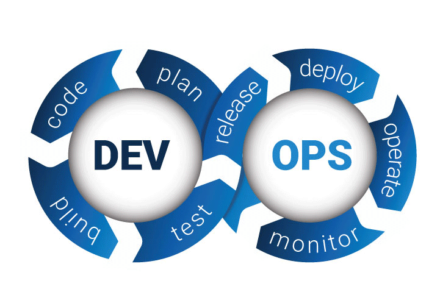

<p align="center" style="vertical-align: top;">
    
</p>

<p align="left">
    <!-- GitHub Followers -->
    <a href="https://github.com/swapnilyavalkar" target="_blank">
        
    </a> 
   
     <a href="https://github.com/swapnilyavalkar/.github/blob/main/LICENSE" target="_blank">
        
    </a><a href="https://github.com/ik-workshop/workshop-blueprint" target="_blank">
        </a><a href="https://github.com/ik-workshop/workshop-blueprint" target="_blank">
        </a> 
</p>

[](https://git.io/typing-svg)

---
<h1 align="center">🧑‍💻 About Me</h1>

💻 **Cloud & DevOps Engineer** | 🔧 **Automation Expert** | 📊 **BI Specialist**

I’m passionate about **cloud computing, automation**, and **DevOps**, and I've worked with multiple organizations to optimize their cloud infrastructure, reduce operational costs, and streamline deployments through CI/CD pipelines. My experience in **Business Intelligence** also includes implementing large-scale solutions using Tableau and SAP BO.

---
<h1 align="center">🎓 Certifications</h1>

<div style="display: flex; flex-direction: column; gap: 5px;">

  <!-- AWS Certification -->
  <div style="display: flex; align-items: center; gap: 5px;">
    
    <span style="font-weight: bold;">AWS Certified Solutions Architect - Professional</span>
  </div>

  <!-- Java Certification -->
  <div style="display: flex; align-items: center; gap: 5px;">
    
    <span style="font-weight: bold;">Sun Certified Java Programmer</span>
  </div>

  <!-- Cisco Certification -->
  <div style="display: flex; align-items: center; gap: 5px;">
    
    <span style="font-weight: bold;">Cisco Certified Network Associate</span>
  </div>

</div>

---
<h1 align="center">💻 Tech Stack</h1>

<table style="border-collapse: collapse; width: 100%; border: 0px solid white;">
  <tr>
    <!-- Left Column: Tech Stack -->
    <td style="vertical-align: top; border: 0px solid white; padding: 0px;">
      <h3>Languages</h3>
      <p>
        
        
        
        
        
        
        
      </p>
      <h3>Cloud Platforms</h3>
      <p>
        
        
        
        
        
        
      </p>
      <h3>DevOps Tools</h3>
      <p>
        
        
        
        
        
        
      </p>
      <h3>Automation & Monitoring</h3>
      <p>
        
        
        
        
        
      </p>
    </td>
    <!-- Right Column: Image -->
    <td style="text-align: center; vertical-align: top;">
      
    </td>
  </tr>
</table>

---

<h1 align="center">🏆 Some Completed Projects</h1>

Here are some **key projects** I’ve worked on, showcasing my experience in **AWS and DevOps**:

1. **Cloud Infrastructure Optimization for E-commerce Platform**  
   *Optimized AWS infrastructure for a global e-commerce company, reducing costs by 30% through EC2 Spot Instances and Reserved Instances (RIs), while automating the environment with CloudFormation templates.*  
   **Technologies**: AWS (EC2, RDS, S3, CloudFormation), Jenkins, Docker.

2. **CI/CD Pipeline Implementation for an Online Payment Firm**  
   *Designed and implemented a CI/CD pipeline using Jenkins for a payment processing company, reducing deployment times by 50% and improving software delivery efficiency.*  
   **Technologies**: Jenkins, Docker, Kubernetes, AWS ECS.

3. **Highly Available Tableau Deployment for a Fortune 500 Company**  
   *Deployed a highly available multi-node Tableau environment on AWS with RDS for database storage, S3 for backups, and CloudWatch for monitoring. Ensured continuous uptime with Auto Scaling and Elastic Load Balancing.*  
   **Technologies**: AWS (EC2, RDS, S3, CloudWatch), Tableau, Auto Scaling.

4. **Serverless API for Retail Analytics**  
   *Developed and deployed a serverless API for a retail company using AWS Lambda, API Gateway, and DynamoDB to handle real-time analytics data processing.*  
   **Technologies**: AWS Lambda, API Gateway, DynamoDB, S3.

---
<h1 align="center">🛠️ Applications Development & Utilities</h1>

<p align="center">
    <a href="https://github.com/swapnilyavalkar/aws-features-explorer-app">
        
    </a>
    <a href="https://github.com/swapnilyavalkar/aws-lambda-contact-form">
        
    </a>
</p>
<p align="center">
    <a href="https://github.com/swapnilyavalkar/dynamicweb-nodeapp">
        
    </a>
    <a href="https://github.com/swapnilyavalkar/task-management-app">
        
    </a>
</p>
<p align="center">
    <a href="https://github.com/swapnilyavalkar/streamlit-time-series-forecasting-app">
        
    </a>
    <a href="https://github.com/swapnilyavalkar/rebranded-streamlit-forecasting-app">
        
    </a>
</p>

---

<h1 align="center">📊 Tableau Utilities</h1>

<p align="center">
    <a href="https://github.com/swapnilyavalkar/tableau_metadata_extractor">
        
    </a>
    <a href="https://github.com/swapnilyavalkar/tableau-server-backup">
        
    </a>
</p>
<p align="center">
    <a href="https://github.com/swapnilyavalkar/tableau-subscriptions-removal">
        
    </a>
    <a href="https://github.com/swapnilyavalkar/tableau-sync--users">
        
    </a>
</p>
<p align="center">
    <a href="https://github.com/swapnilyavalkar/tableau-change-bulk-user-roles">
        
    </a>
    <a href="https://github.com/swapnilyavalkar/tableau-update-datasource-script">
        
    </a>
</p>

---

<h1 align="center">🏢 SAP Business Objects</h1>

<p align="center">
    <a href="https://github.com/swapnilyavalkar/sap-bo-getting-sql-queries-webi-reports">
        
    </a>
    <a href="https://github.com/swapnilyavalkar/userdetailsbi41">
        
    </a>
</p>
<p align="center">
    <a href="https://github.com/swapnilyavalkar/sap-bo-folder-report-structure">
        
    </a>
    <a href="https://github.com/swapnilyavalkar/sap-bo-universe-reports-extractor">
        
    </a>
</p>

---

<h1 align="center">🔧 Monitoring & Infrastructure Automation</h1>

<p align="center">
    <a href="https://github.com/swapnilyavalkar/disk-space-monitoring">
        
    </a>
    <a href="https://github.com/swapnilyavalkar/ssl-cert-monitoring">
        
    </a>
</p>
<p align="center">
    <a href="https://github.com/swapnilyavalkar/grafana">
        
    </a>
    <a href="https://github.com/swapnilyavalkar/prometheus">
        
    </a>
</p>

---

<h1 align="center">☁️ AWS & DevOps Projects</h1>

<p align="center">
    <a href="https://github.com/swapnilyavalkar/aws-devops-realworld-projects">
        
    </a>

</p>

<details>
<p align="center"><summary><strong>📂 Click to Expand Repository Structure</strong></summary></p>

```bash
📦 aws-devops-realworld-projects
 ┣ 📂 aws-infrastructure-projects
 ┃ ┣ 📂 easy
 ┃ ┃ ┣ 📂 01-cloudfront-s3-static-websites
 ┃ ┃ ┣ 📂 02-s3-crossregion-replication
 ┃ ┃ ┣ 📂 03-security-best-practices-iam
 ┃ ┃ ┣ 📂 04-ec2-autoscaling-loadbalancer
 ┃ ┃ ┣ 📂 05-monitoring-ecs-prometheus-grafana
 ┃ ┃ ┗ 📂 06-infrastructure-as-code-cloudformation
 ┃ ┣ 📂 medium
 ┃ ┃ ┣ 📂 01-multiregion-failover-route53
 ┃ ┃ ┣ 📂 02-loadbalancing-alb-nlb
 ┃ ┃ ┣ 📂 03-automated-backups-aws-backup
 ┃ ┃ ┣ 📂 04-secure-configurations-secretsmanager
 ┃ ┃ ┣ 📂 05-lambdaatedge-content-delivery
 ┃ ┃ ┣ 📂 06-data-lake-s3-athena-glue
 ┃ ┃ ┣ 📂 07-s3-event-driven-architecture-with-sns-lambda-sqs
 ┃ ┃ ┗ 📂 08-serverless-lambda-api-gateway-dynamodb
 ┃ ┣ 📂 hard
 ┃ ┃ ┣ 📂 01-api-security-waf
 ┃ ┃ ┣ 📂 02-vpc-peering-transitive-routing
 ┃ ┃ ┣ 📂 03-data-migration-dms
 ┃ ┃ ┣ 📂 04-stepfunctions-orchestration
 ┃ ┃ ┣ 📂 05-amazon-aurora-highavailability
 ┃ ┃ ┗ 📂 06-graphql-api-appsync
 ┃ ┣ 📂 complex
 ┃ ┃ ┣ 📂 01-multiregion-activeactive-rds
 ┃ ┃ ┣ 📂 02-data-lakehouse-redshift-s3
 ┃ ┃ ┣ 📂 03-data-governance-lakeformation
 ┃ ┃ ┣ 📂 04-hybrid-cloud-aws-outposts-s3
 ┃ ┃ ┣ 📂 05-edge-computing-greengrass
 ┃ ┃ ┣ 📂 06-security-compliance-macie-guardduty
 ┃ ┃ ┣ 📂 07-codeartifact-codepipeline
 ┃ ┃ ┣ 📂 08-serverless-container-fargate
 ┃ ┃ ┣ 📂 09-rds-proxy-aurora-optimization
 ┃ ┃ ┗ 📂 10-serverless-container-lambda
 ┗ 📂 devops-projects
 ┃ ┣ 📂 easy
 ┃ ┃ ┣ 📂 01-ci-cd-jenkins-docker
 ┃ ┃ ┣ 📂 02-ci-cd-jenkins-ec2
 ┃ ┃ ┣ 📂 03-kubernetes-cluster-kops
 ┃ ┃ ┣ 📂 04-kubernetes-cluster-terraform
 ┃ ┃ ┣ 📂 05-automated-deployment-codebuild
 ┃ ┃ ┗ 📂 06-ci-cd-jenkins-github-elastic-beanstalk
 ┃ ┣ 📂 medium
 ┃ ┃ ┣ 📂 01-automated-deployment-codedeploy
 ┃ ┃ ┣ 📂 02-containerized-microservices-ecs
 ┃ ┃ ┣ 📂 03-stepfunctions-orchestration
 ┃ ┃ ┣ 📂 04-realtime-dataanalytics-kinesis-lambda
 ┃ ┃ ┣ 📂 05-containerized-microservices-eks
 ┃ ┃ ┗ 📂 06-automated-microservices-deployment-ecs-cicd
 ┃ ┣ 📂 hard
 ┃ ┃ ┣ 📂 01-deploying-microservices-ecs
 ┃ ┃ ┣ 📂 02-music-streaming-service-aws
 ┃ ┃ ┣ 📂 03-video-streaming-service-aws
 ┃ ┃ ┣ 📂 04-serverless-webapp-aws-amplify
 ┃ ┃ ┣ 📂 05-scalable-node.js-app-deployment-elastic-beanstalk
 ┃ ┃ ┗ 📂 06-enterprise-application-deployment-kubernetes-terraform-ansible-gitlab
 ┃ ┣ 📂 complex
 ┃ ┃ ┣ 📂 01-ecs-bluegreen-deployment
 ┃ ┃ ┣ 📂 02-music-streaming-portal-amazonmusic
 ┃ ┃ ┣ 📂 03-video-streaming-netflix
 ┃ ┃ ┣ 📂 04-image-processing-sagemaker
 ┃ ┃ ┣ 📂 05-advanced-cicd-pipeline-codepipeline
 ┃ ┃ ┣ 📂 06-sagemaker-ml-pipeline
 ┃ ┃ ┣ 📂 07-realtime-video-processing-kinesis-s3
 ┃ ┃ ┗ 📂 08-full-stack-cicd-pipeline-jenkins-aws-codedeploy-nginx
```

</details>

---
<h1 align="center">🔗 Connect with Me</h1>

<p align="center">
    <a href="mailto:swapnil.yavalkar@hotmail.com" target="_blank"></a>&nbsp;
    <a href="https://www.linkedin.com/in/swapnilyavalkar">
        </a>&nbsp;
    <a href="https://github.com/swapnilyavalkar" target="_blank">
        </a>&nbsp;
    <a href="https://hub.docker.com/u/swapnilyavalkar" target="_blank">
        </a>&nbsp;
</p>

<p align="left">
<strong> I’m always open to connecting with fellow professionals and collaborating on exciting AWS, DevOps, or Automation projects! Let’s discuss how I can help you automate cloud processes or streamline your DevOps pipelines. Feel free to reach out for any Freelance Projects.
</strong>
</p>

---

<h1 align="center">📈 GitHub Stats</h1>

<p align="center">
    &nbsp;
    
</p>
<p align="center">
    
</p>

<a href="https://git.io/typing-svg"></a>
